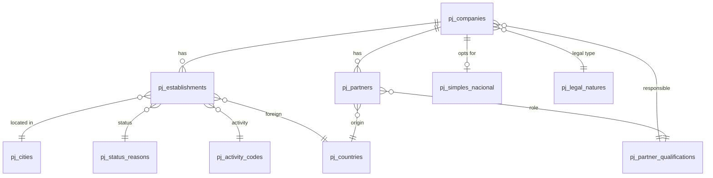

### CNPJ Data Schema

CSV file layout provided by Receita Federal.

#### Relationships

> Historical data may contain legitimate inconsistencies (old city codes, deactivated CNAEs, etc.). Avoid enforcing full referential integrity.

#### File Format

| Property   | Value             |
| ---------- | ----------------- |
| Encoding   | ISO-8859-1        |
| Separator  | `;` (semicolon)   |
| Null dates | `0` or `00000000` |
| Update     | Monthly           |

#### Main Tables

##### pj_companies

| Column                        | Description                                  |
| ----------------------------- | -------------------------------------------- |
| cnpj                          | First 8 digits of CNPJ                       |
| social_reason_name            | Legal company name                           |
| legal_nature_name             | Code -> pj_legal_natures                     |
| responsible_qualification     | Code -> pj_partner_qualifications            |
| social_capital                | Share capital (Brazilian format: `1.234,56`) |
| company_size                  | Size code                                    |
| responsible_federative_entity | Filled only for legal nature 1XXX            |

**Company size codes:**

- `00` - Not informed
- `01` - Micro enterprise
- `03` - Small business
- `05` - Other

##### pj_establishments

| Column                               | Description                    |
| ------------------------------------ | ------------------------------ |
| cnpj                                 | First 8 digits                 |
| cnpj_establishment                   | 4 digits (0001 = headquarters) |
| cnpj_check_digit                     | 2 check digits                 |
| filial_identifier                    | 1 = Headquarters, 2 = Branch   |
| fantasy_name                         | Trade name                     |
| status                               | Registration status code       |
| status_date                          | Status event date              |
| status_reason                        | Code -> pj_status_reasons      |
| exterior_city_name                   | If domiciled abroad            |
| country                              | Code -> pj_countries           |
| activity_start_date                  | Opening date                   |
| cnae_primary                         | Code -> pj_activity_codes      |
| cnae_secondary                       | Comma-separated codes          |
| street_type                          | RUA, AV, etc.                  |
| street                               | Street name                    |
| number                               | Number or S/N                  |
| complement                           | Address complement             |
| district                             | District                       |
| zip_code                             | Zip code                       |
| state                                | State abbreviation             |
| city                                 | Code -> pj_cities              |
| area_code_primary, phone_primary     | Primary contact                |
| area_code_secondary, phone_secondary | Secondary contact              |
| fax_area_code, fax                   | Fax                            |
| email                                | Email address                  |
| special_status                       | Special status                 |
| special_status_date                  | Special status date            |

**Registration status codes:**

- `01` - Null
- `02` - Active
- `03` - Suspended
- `04` - Unfit
- `08` - Closed

##### pj_partners

| Column                       | Description                               |
| ---------------------------- | ----------------------------------------- |
| cnpj                         | First 8 digits                            |
| partner_type                 | Partner type                              |
| partner_name                 | Name (individual) or legal name (company) |
| partner_document             | Masked CPF or CNPJ                        |
| partner_qualification        | Code -> pj_partner_qualifications         |
| entry_date                   | Partnership entry date                    |
| country                      | Code -> pj_countries (if foreign)         |
| legal_representative         | Representative CPF                        |
| representative_name          | Representative name                       |
| representative_qualification | Code -> pj_partner_qualifications         |
| age_range                    | Age range code                            |

**Partner type codes:**

- `1` - Legal entity
- `2` - Individual
- `3` - Foreign

**Age range codes:**

- `0` - Not applicable
- `1` - 0-12 years
- `2` - 13-20 years
- `3` - 21-30 years
- `4` - 31-40 years
- `5` - 41-50 years
- `6` - 51-60 years
- `7` - 61-70 years
- `8` - 71-80 years
- `9` - 80+ years

**CPF masking:** The first 3 and last 2 digits are hidden (`***XXXXXX**`).

##### pj_simples_nacional

| Column                 | Description                    |
| ---------------------- | ------------------------------ |
| cnpj                   | First 8 digits                 |
| simples_option         | S = Yes, N = No, blank = Other |
| simples_option_date    | Option date                    |
| simples_exclusion_date | Exclusion date                 |
| mei_option             | S = Yes, N = No, blank = Other |
| mei_option_date        | Option date                    |
| mei_exclusion_date     | Exclusion date                 |

#### Reference Tables

| Table                     | Columns           |
| ------------------------- | ----------------- |
| pj_activity_codes         | code, description |
| pj_status_reasons         | code, description |
| pj_cities                 | code, description |
| pj_legal_natures          | code, description |
| pj_countries              | code, description |
| pj_partner_qualifications | code, description |

#### Official Sources

- **Download**: https://arquivos.receitafederal.gov.br/index.php/s/YggdBLfdninEJX9
- **CSV Layout**: https://www.gov.br/receitafederal/dados/cnpj-metadados.pdf
- **Technical Note 47/2024**: https://www.gov.br/receitafederal/dados/nota_cocad_no_47_2024.pdf/
- **Technical Note 86/2024**: https://www.gov.br/receitafederal/dados/nota-cocad-rfb-86-2024.pdf/
