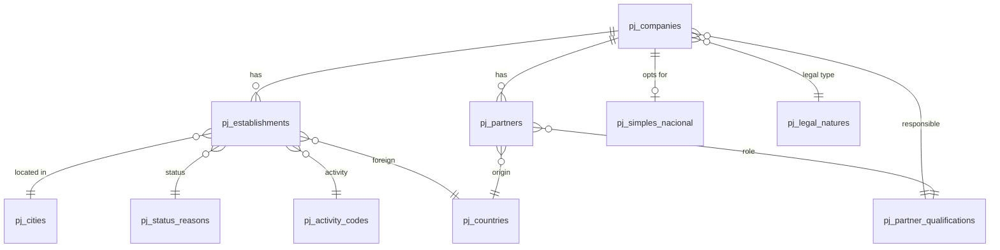

# CNPJ Data Schema

CSV file layout provided by Receita Federal.

## Relationships

> Historical data may contain legitimate inconsistencies (old city codes, deactivated CNAEs, etc.). Avoid enforcing full referential integrity.

## File Format

<table width="100%">
<tr><th>Property</th><th>Value</th></tr>
<tr><td>Encoding</td><td>ISO-8859-1</td></tr>
<tr><td>Separator</td><td><code>;</code> (semicolon)</td></tr>
<tr><td>Null dates</td><td><code>0</code> or <code>00000000</code></td></tr>
<tr><td>Update</td><td>Monthly</td></tr>
</table>

## Main Tables

### pj_companies

<table width="100%">
<tr><th>Column</th><th>Description</th></tr>
<tr><td>cnpj</td><td>First 8 digits of CNPJ</td></tr>
<tr><td>social_reason_name</td><td>Legal company name</td></tr>
<tr><td>legal_nature_name</td><td>Code -> pj_legal_natures</td></tr>
<tr><td>responsible_qualification</td><td>Code -> pj_partner_qualifications</td></tr>
<tr><td>social_capital</td><td>Share capital (Brazilian format: <code>1.234,56</code>)</td></tr>
<tr><td>company_size</td><td>Size code</td></tr>
<tr><td>responsible_federative_entity</td><td>Filled only for legal nature 1XXX</td></tr>
</table>

**Company size codes:**

- `00` - Not informed
- `01` - Micro enterprise
- `03` - Small business
- `05` - Other

### pj_establishments

<table width="100%">
<tr><th>Column</th><th>Description</th></tr>
<tr><td>cnpj</td><td>First 8 digits</td></tr>
<tr><td>cnpj_establishment</td><td>4 digits (0001 = headquarters)</td></tr>
<tr><td>cnpj_check_digit</td><td>2 check digits</td></tr>
<tr><td>filial_identifier</td><td>1 = Headquarters, 2 = Branch</td></tr>
<tr><td>fantasy_name</td><td>Trade name</td></tr>
<tr><td>status</td><td>Registration status code</td></tr>
<tr><td>status_date</td><td>Status event date</td></tr>
<tr><td>status_reason</td><td>Code -> pj_status_reasons</td></tr>
<tr><td>exterior_city_name</td><td>If domiciled abroad</td></tr>
<tr><td>country</td><td>Code -> pj_countries</td></tr>
<tr><td>activity_start_date</td><td>Opening date</td></tr>
<tr><td>cnae_primary</td><td>Code -> pj_activity_codes</td></tr>
<tr><td>cnae_secondary</td><td>Comma-separated codes</td></tr>
<tr><td>street_type</td><td>RUA, AV, etc.</td></tr>
<tr><td>street</td><td>Street name</td></tr>
<tr><td>number</td><td>Number or S/N</td></tr>
<tr><td>complement</td><td>Address complement</td></tr>
<tr><td>district</td><td>District</td></tr>
<tr><td>zip_code</td><td>Zip code</td></tr>
<tr><td>state</td><td>State abbreviation</td></tr>
<tr><td>city</td><td>Code -> pj_cities</td></tr>
<tr><td>area_code_primary, phone_primary</td><td>Primary contact</td></tr>
<tr><td>area_code_secondary, phone_secondary</td><td>Secondary contact</td></tr>
<tr><td>fax_area_code, fax</td><td>Fax</td></tr>
<tr><td>email</td><td>Email address</td></tr>
<tr><td>special_status</td><td>Special status</td></tr>
<tr><td>special_status_date</td><td>Special status date</td></tr>
</table>

**Registration status codes:**

- `01` - Null
- `02` - Active
- `03` - Suspended
- `04` - Unfit
- `08` - Closed

### pj_partners

<table width="100%">
<tr><th>Column</th><th>Description</th></tr>
<tr><td>cnpj</td><td>First 8 digits</td></tr>
<tr><td>partner_type</td><td>Partner type</td></tr>
<tr><td>partner_name</td><td>Name (individual) or legal name (company)</td></tr>
<tr><td>partner_document</td><td>Masked CPF or CNPJ</td></tr>
<tr><td>partner_qualification</td><td>Code -> pj_partner_qualifications</td></tr>
<tr><td>entry_date</td><td>Partnership entry date</td></tr>
<tr><td>country</td><td>Code -> pj_countries (if foreign)</td></tr>
<tr><td>legal_representative</td><td>Representative CPF</td></tr>
<tr><td>representative_name</td><td>Representative name</td></tr>
<tr><td>representative_qualification</td><td>Code -> pj_partner_qualifications</td></tr>
<tr><td>age_range</td><td>Age range code</td></tr>
</table>

**Partner type codes:**

- `1` - Legal entity
- `2` - Individual
- `3` - Foreign

**Age range codes:**

- `0` - Not applicable
- `1` - 0-12 years
- `2` - 13-20 years
- `3` - 21-30 years
- `4` - 31-40 years
- `5` - 41-50 years
- `6` - 51-60 years
- `7` - 61-70 years
- `8` - 71-80 years
- `9` - 80+ years

**CPF masking:** The first 3 and last 2 digits are hidden (`***XXXXXX**`).

### pj_simples_nacional

<table width="100%">
<tr><th>Column</th><th>Description</th></tr>
<tr><td>cnpj</td><td>First 8 digits</td></tr>
<tr><td>simples_option</td><td>S = Yes, N = No, blank = Other</td></tr>
<tr><td>simples_option_date</td><td>Option date</td></tr>
<tr><td>simples_exclusion_date</td><td>Exclusion date</td></tr>
<tr><td>mei_option</td><td>S = Yes, N = No, blank = Other</td></tr>
<tr><td>mei_option_date</td><td>Option date</td></tr>
<tr><td>mei_exclusion_date</td><td>Exclusion date</td></tr>
</table>

## Reference Tables

<table width="100%">
<tr><th>Table</th><th>Columns</th></tr>
<tr><td>pj_activity_codes</td><td>code, description</td></tr>
<tr><td>pj_status_reasons</td><td>code, description</td></tr>
<tr><td>pj_cities</td><td>code, description</td></tr>
<tr><td>pj_legal_natures</td><td>code, description</td></tr>
<tr><td>pj_countries</td><td>code, description</td></tr>
<tr><td>pj_partner_qualifications</td><td>code, description</td></tr>
</table>

## Official Sources

- **Download**: https://arquivos.receitafederal.gov.br/index.php/s/YggdBLfdninEJX9
- **CSV Layout**: https://www.gov.br/receitafederal/dados/cnpj-metadados.pdf
- **Technical Note 47/2024**: https://www.gov.br/receitafederal/dados/nota_cocad_no_47_2024.pdf/
- **Technical Note 86/2024**: https://www.gov.br/receitafederal/dados/nota-cocad-rfb-86-2024.pdf/
